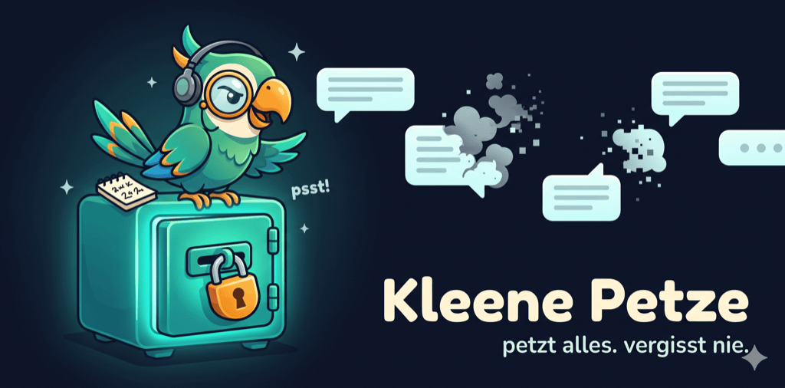
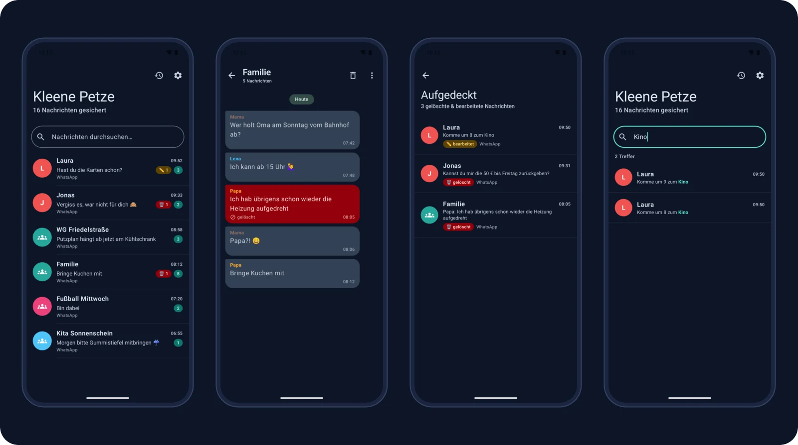
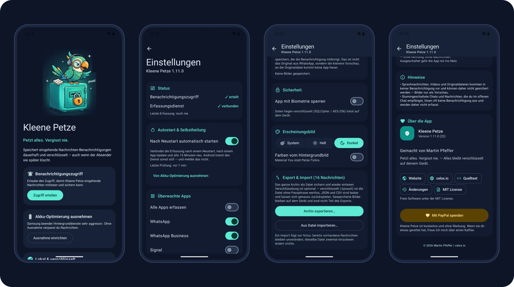

<div align="center">

<a href="https://kleene-petze.celox.io"></a>

# 🦜 Kleene Petze

**Petzt alles. Vergisst nie.** — ein verschlüsseltes, dauerhaftes Archiv deiner Nachrichten-Benachrichtigungen für Android. Gelöschte WhatsApp-Nachrichten bleiben lesbar.

<p>
  <a href="https://kleene-petze.celox.io"></a>
  &nbsp;
  <a href="https://kleene-petze.celox.io/download"></a>
  &nbsp;
  <a href="https://www.paypal.com/donate/?business=martin.pfeffer@celox.io&currency_code=EUR&item_name=Kleene%20Petze"></a>
</p>

<h3>👉 <a href="https://kleene-petze.celox.io">kleene-petze.celox.io</a> — Funktionen, Installationsanleitung, FAQ und immer die neueste APK</h3>

<!-- Generated by scripts/update-badges.py — never edit these four by hand (ReadmeBadgesTest). -->
[](https://github.com/pepperonas/kleene-petze/releases/latest)
[](app/src/test)
[](app/src/main/java)
[](app/src/test)

</div>

<!-- Project status -->
<p align="center">
  <a href="https://github.com/pepperonas/kleene-petze/releases/latest"></a>
  <a href="https://github.com/pepperonas/kleene-petze/releases/latest"></a>
  <a href="https://github.com/pepperonas/kleene-petze/releases"></a>
  <a href="https://github.com/pepperonas/kleene-petze/releases/latest"></a>
  <a href="https://github.com/pepperonas/kleene-petze/actions/workflows/release.yml"></a>
</p>
<p align="center">
  <a href="https://github.com/pepperonas/kleene-petze/commits/main"></a>
  <a href="https://github.com/pepperonas/kleene-petze/commits/main"></a>
  <a href="https://github.com/pepperonas/kleene-petze/issues"></a>
  
  
  
</p>

<!-- Tech stack -->
<p align="center">
  
  
  
  
  
  
</p>
<p align="center">
  
  
  
  
  
</p>

<!-- Data & privacy -->
<p align="center">
  
  
  
  
  
  
  <a href="LICENSE"></a>
  
</p>

<!-- Promises -->
<p align="center">
  
  
  
  
  
  <a href="https://kleene-petze.celox.io"></a>
  <a href="CHANGELOG.md"></a>
  <a href="https://github.com/pepperonas/kleene-petze/stargazers"></a>
  <a href="https://www.paypal.com/donate/?business=martin.pfeffer@celox.io&currency_code=EUR&item_name=Kleene%20Petze"></a>
</p>

[English](README.md) · **Deutsch**

Speichert eingehende Nachrichten-Benachrichtigungen **dauerhaft und verschlüsselt** – wie
der Samsung-Benachrichtigungsverlauf, aber ohne 24-Stunden-Verfall. Gelöschte WhatsApp-
Nachrichten bleiben so lesbar, weil die ursprüngliche Benachrichtigung in eine lokale,
verschlüsselte Datenbank geschrieben wird, sobald sie ankommt.

## Screenshots

<p align="center">
  
</p>
<p align="center">
  
</p>

<sub>Material 3 Expressive im dunklen Design. Die Chats sind für die Screenshots erfunden — nie echte Nachrichten.</sub>

## Download

Die fertige, signierte APK gibt es auf **[kleene-petze.celox.io](https://kleene-petze.celox.io)**
und unter **[Releases](https://github.com/pepperonas/kleene-petze/releases/latest)**.
APK herunterladen → auf dem Gerät öffnen → Installation aus unbekannter Quelle erlauben.

Neue Versionen meldet die App auf Wunsch selbst: *Einstellungen → Updates → Nach Updates suchen*
(standardmäßig aus, siehe [Datenschutz](#datenschutz--dsgvo)). Was sich geändert hat, steht im
[CHANGELOG](CHANGELOG.md).

## Neu in 1.11.0

- **Englisch und Deutsch** – die App gibt es jetzt in beiden Sprachen. Die Sprache des Telefons
  entscheidet; bei jeder anderen Sprache zeigt die App Englisch.
- Ab **Android 13** lässt sich die App-Sprache unabhängig vom Telefon einstellen:
  *Einstellungen → Apps → Kleene Petze → Sprache*.
- Ein Unit-Test (`LocalizationTest`) hält beide Sprachen im Gleichschritt – gleiche Schlüssel und
  gleiche Format-Platzhalter.

## Neu in 1.10.0

- **Material 3 Expressive** – `MaterialExpressiveTheme` mit federbasiertem `MotionScheme`: große
  flexible Kopfzeilen, Einstellungen als Karten mit gestaffeltem Einfedern, Bildschirmübergänge,
  federnde Druck-Rückmeldung, `LoadingIndicator`, verbundene Button-Gruppe für Hell/Dunkel/System.
  „Animationen entfernen“ wird respektiert.
- **Über die App** – Version, Website, Quelltext, Änderungen, Lizenz und ein PayPal-Spendenknopf.
- **Optionale Update-Prüfung** – aus, bis du sie einschaltest.
- **Sperre repariert** – mit aktiver App-Sperre gingen Export und Import verloren; jetzt bleibt die
  Oberfläche unter der Sperre erhalten, die App-Übersicht zeigt keine Inhalte (`FLAG_SECURE`).
- Details und alle weiteren Korrekturen: [CHANGELOG](CHANGELOG.md).

## Wie es funktioniert

Android liefert jede Benachrichtigung an einen `NotificationListenerService`
(`service/NotificationCaptureService.kt`). WhatsApp sendet beim Löschen einer Nachricht
**keine** zweite Benachrichtigung – die Originalnachricht ist also längst angekommen.
Kleene Petze parst sie sofort (bevorzugt über `MessagingStyle`, das Absender + echten
Zeitstempel jeder Einzelnachricht enthält) und speichert sie ab. Mehrfach gelieferte
Nachrichten werden über einen Inhalts-Hash dedupliziert.

**Korrekte Chat-Zuordnung:** Nachrichten werden über einen *stabilen* Chat-Schlüssel
(`conversationKey` aus `shortcutId` → `tag` → Notification-Slot → Titel) gruppiert, nicht
über den Anzeigenamen. Der ist bei 1:1-Chats oft leer und bei Gruppen manchmal nicht
gesetzt – würde man danach gruppieren, zerfielen Gruppen pro Absender bzw. vermischten
sich mit gleichnamigen Einzelchats. So landet jeder Kontakt/jede Gruppe verlässlich in
genau einem Verlauf. Die Übersicht zeigt pro Chat den **neuesten Titel** + letzte
Nachricht; der Verlauf rendert als Chat-Ansicht mit Datumstrennern, Sprecher-Gruppierung
und farbigen Absendern.

Genau hier lag der Fehler, den **v1.6.2** behebt: WhatsApp liefert bei manchen
Benachrichtigungen keinen Gruppennamen mit. Ohne `shortcutId`/`tag` fiel der Schlüssel
dann auf den **Absender** zurück – die Gruppe zerfiel pro Absender *und* verschmolz mit
den Einzelchats derselben Leute, tauchte also nie als eigener Chat auf. Deshalb wurden
manche Gruppen mitgeschnitten und andere scheinbar nicht. Für Gruppen ist der Absender
jetzt nie mehr Schlüssel oder Titel; ohne eigene ID zählt der **Notification-Slot**, den
der Messenger für diesen Chat wiederverwendet – genauso verlässlich wie das
In-Place-Update, auf dem die ganze Erfassung ohnehin beruht. Der Gruppenname taugt dafür
nicht, weil er in einer Benachrichtigung fehlt und in der nächsten dasteht (der Chat
würde sich teilen). 1:1-Chats bleiben unverändert.

**Rauschfilter (v1.6.2–v1.7.2):** Nicht alles, was ein Messenger postet, ist eine
Nachricht. WhatsApps dauerhafte Dienst-Benachrichtigung („Überprüfe auf neue
Nachrichten"), Backup-/Wiederherstellungs-Fortschritt sowie **Sprach- und Videoanrufe**
(auch verpasste, die WhatsApp separat führt) landen nicht mehr im Archiv – strukturell
über Notification-Flags und -Kategorien (sprachunabhängig) und zusätzlich über eine
Phrasenliste für Geräte, die beides nicht setzen. Geprüft wird **Titel und Text**: ein
verpasster Anruf trägt seinen Wortlaut im *Titel* („Verpasster Sprachanruf") und den
Kontaktnamen im Text – prüfte man nur den Text, rutschte er durch und tauchte, weil der
Titel zum Chatnamen wird, als eigener Chat „Verpasster Sprachanruf" in der Übersicht auf
(genau das behebt v1.6.4). Bereits erfasstes Rauschen wird beim Update einmalig entfernt.

**Medien-Fortschritt (v1.7.2):** Beim Senden von Fotos/Videos zeigt WhatsApp eine laufend
aktualisierte Fortschritts-Benachrichtigung („Sending video to …") – auf einem echten Gerät hatten
sich daraus **2380 Einträge** in einem Müll-Chat angesammelt. Entscheidend ist hier nicht die
Wortliste, sondern dass eine Benachrichtigung mit **Fortschrittsbalken** (`EXTRA_PROGRESS`) nie
eine Nachricht ist – das greift in jeder Sprache. Dasselbe Gerät zeigte außerdem, dass WhatsApp
einen laufenden Anruf „Aktiver Sprachanruf" nennt, was keine bisherige Phrase abdeckte.

## Bilder mit Kommentar (v1.9.0)

**Der Kommentar unter einem Bild war nie das Problem** – er *ist* der Nachrichtentext und wurde
immer gesichert. Verloren gingen zwei andere Dinge:

* **Bilder ohne Kommentar** verschwanden komplett. Eine Nachricht braucht Text, um überhaupt eine
  Identität zu haben (die ID ist ein Hash über den Inhalt), und der Extractor verwarf jede
  MessagingStyle-Nachricht mit leerem Text. Sie bekommt jetzt einen Platzhalter und bleibt erhalten.
* **Das Bild selbst** wurde nie gespeichert.

Was jetzt gesichert wird, ist die **Vorschau, die die Benachrichtigung mitbringt** – nicht die
Originaldatei. Der Unterschied ist wichtig und keine Bequemlichkeit: an WhatsApps Medienordner kommt
seit Scoped Storage keine fremde App mehr heran. Die Vorschau dagegen liegt in der Benachrichtigung,
und ein Benachrichtigungs-Listener darf sie lesen – laut Android-Doku wird ihm für **jede** URI einer
Benachrichtigung Lesezugriff erteilt, allerdings **nur solange sie aktiv ist**. Deshalb wird das Bild
sofort beim Eintreffen dekodiert und nie eine URI für später gemerkt.

| Quelle | wann |
|---|---|
| `MessagingStyle.Message.getDataUri()` | der übliche Weg – das Bild hängt an der einzelnen Nachricht |
| `BigPictureStyle` (`EXTRA_PICTURE`) | ältere Aufbauten, das Bild hängt an der Benachrichtigung |

Gespeichert wird als JPEG (max. 1280 px, max. 512 KB) **als BLOB in der verschlüsselten Datenbank**,
nicht als Datei – sonst wäre ausgerechnet das Bild der unverschlüsselte Teil des Archivs. In einer
eigenen Tabelle, damit die Übersichts- und Chat-Abfragen nicht bei jedem Aufruf Bilddaten
mitschleppen. Abschaltbar unter *Einstellungen → Bilder*, samt Speicherverbrauch und einem Knopf,
der nur die Bilder wieder entfernt.

**Sprachnachrichten und Videos bleiben außen vor** – dafür gibt es keine Vorschau in der
Benachrichtigung. Und **Bilder sind nicht Teil des Exports**: sie bleiben auf dem Gerät.

## Autostart & Selbstheilung (v1.8.0)

Der größte denkbare Fehler dieser App ist nicht ein Absturz, sondern **stilles Nichtstun**: Der
Erfassungsdienst wird nicht von der App gestartet, sondern vom System *gebunden* – und Android löst
diese Bindung in drei Situationen, ohne es irgendwo zu melden:

* **nach einem App-Update** – das System hängt den alten Code aus und bindet den neuen
  manchmal nicht wieder ein (bekannter Plattformfehler),
* **wenn der Hersteller den Prozess abschießt** – Samsungs „Tiefschlaf" trennt nicht höflich,
  also läuft `onListenerDisconnected()` nie und der bisherige Selbstreparatur-Aufruf darin auch nicht,
* **nach einem Neustart**, wenn die Bindung nicht wiederhergestellt wird.

In allen drei Fällen läuft im Dienst nichts mehr, was sich melden könnte. Die Reparatur muss
deshalb **von außen** kommen:

| Mechanismus | greift |
|---|---|
| `BootReceiver` (`BOOT_COMPLETED`, `QUICKBOOT_POWERON`) | nach jedem Neustart |
| derselbe Receiver auf `MY_PACKAGE_REPLACED` | nach jedem App-Update – die wahrscheinlichste Ursache dafür, dass die Erfassung „plötzlich" stand |
| `WatchdogJobService`, alle 15 Min, `setPersisted` | jederzeit sonst; überlebt selbst einen Neustart ohne Broadcast |
| Knopf „Neu verbinden" im Banner + in den Einstellungen | sofort, wenn du es selbst bemerkst |

Alles zusammen liegt unter *Einstellungen → Autostart & Selbstheilung* und ist **standardmäßig an**.
Dort steht auch, wann die letzte Prüfung lief. Läuft sie seit über 45 Minuten nicht mehr, ist das
das einzige Symptom, das **kein** Neuverbinden heilen kann: dann hält das Energiesparen die ganze
App an – die Einstellung blendet dafür direkt den Knopf zum Ausnehmen ein.

Das Banner auf der Startseite sagt jetzt außerdem die Wahrheit. Vorher stand dort „verbindet sich
meist von selbst neu" – genau die Annahme, die den Ausfall verursacht hat.

## Export & Import (v1.7.0)

Unter *Einstellungen → Export & Import* lässt sich das komplette Archiv in eine Datei schreiben
und genauso wieder einlesen. **Verschlüsselung ist eine Wahl, kein Zwang** – alle drei Formate
sind vollständig und wieder importierbar:

| Format | Datei | wofür |
|---|---|---|
| **Verschlüsselt** | `.kpvault` | AES-256-GCM, Schlüssel per PBKDF2-HmacSHA256 (210 000 Runden). Für alles, was das Gerät verlässt – ohne Passphrase ist die Datei für niemanden lesbar, auch nicht für dich. |
| **JSON** | `.json` | Klartext, vollständig, zusätzlich mit `jq`/Skripten auswertbar. Gültiges JSON, aber **eine Nachricht pro Zeile**, damit der Import zeilenweise streamen kann. |
| **CSV** | `.csv` | Klartext für Tabellenprogramme (semikolongetrennt, RFC 4180). Enthält alle Spalten, auch Zeilenumbrüche innerhalb einer Nachricht. |

Beim **Import genügt ein Knopf**: das Format wird an den ersten Bytes der Datei erkannt, eine
Passphrase wird nur bei der verschlüsselten Variante abgefragt. Vor dem Schreiben zeigt ein
Dialog, was die Datei enthält (Anzahl, Zeitraum, erkanntes Format). Der Import **fügt nur hinzu** –
IDs sind Inhalts-Hashes, vorhandene Nachrichten bleiben unverändert, dieselbe Datei zweimal
einzulesen ändert nichts.

Export und Import laufen **gestreamt**: die Datenbank wird blockweise gelesen und direkt in die
Datei geschrieben, beim Import werden die Datensätze einzeln geparst und in Blöcken übernommen.
Das Archiv muss also nie als Ganzes in den Arbeitsspeicher passen.

## Was geht – und was nicht

| Funktion | Status |
|---|---|
| Text-Nachrichten (1:1 & Gruppen) | ✅ zuverlässig |
| Absender + echter Zeitstempel | ✅ via MessagingStyle |
| Korrekte Chat-Gruppierung (stabiler `conversationKey`, Gruppen auch ohne Gruppennamen) | ✅ |
| Dienst-/Status-Benachrichtigungen, Anrufe und Medien-Fortschritt werden gefiltert (nicht archiviert) | ✅ |
| Chat-Ansicht: Datumstrenner, Sprecher-Gruppierung, Avatare | ✅ |
| Volltextsuche (mit Treffer-Hervorhebung), App-Filter in der Übersicht | ✅ |
| **Export & Import des ganzen Archivs — Verschlüsselung optional** (`.kpvault` verschlüsselt / JSON / CSV, alle drei wieder einlesbar) | ✅ |
| Export pro Chat (CSV/JSON, verlustfrei inkl. Erfassungszeit + Gelöscht-/Bearbeitet-Status) | ✅ |
| Nachricht kopieren/teilen + Details (Long-Press auf die Sprechblase) | ✅ |
| Verschlüsselung (SQLCipher/AES-256), Biometrie-Sperre (re-lockt im Hintergrund) | ✅ |
| Verschlüsselung des Exports (`.kpvault`, Passphrase → PBKDF2 + AES-256-GCM; Import ist merge-sicher) | ✅ |
| Capture-Status (Zugriff/Dienst/letzte Erfassung) + Warn-Banner | ✅ |
| **Autostart nach Neustart & App-Update + 15-Min-Wächter**, abschaltbar in den Einstellungen | ✅ |
| Optionale Aufbewahrungsdauer (30–365 Tage, Standard: unbegrenzt) | ✅ |
| **Gelöschte Nachrichten markieren** (Original hervorgehoben + 🗑-Badge, gesammelt in der „Aufgedeckt"-Ansicht) | ⚠️ nur wenn die Nachricht gelöscht wird, *während sie noch ungelesen im Benachrichtigungs-Shade liegt* (dann ersetzt WhatsApp den Text durch „…gelöscht", den wir der gespeicherten Originalnachricht zuordnen); Platzhalter in 10 Sprachen erkannt |
| **Bearbeitete Nachrichten aufdecken** (frühere Version bleibt sichtbar, ✏️-Markierung) | ⚠️ gleiche Bedingung: die Bearbeitung muss eine Benachrichtigung auslösen, solange der Chat ungelesen ist |
| **Bilder mit Kommentar** – Kommentar immer, Bildvorschau optional | ✅ der Kommentar ist der Nachrichtentext; das Bild wird als **Vorschau aus der Benachrichtigung** gesichert (JPEG, verschlüsselt in der DB) |
| **Original-Mediendateien** (volle Auflösung, Sprach-/Videonachrichten) | ❌ technisch nicht möglich – die Originaldatei steckt nicht in der Notification, Scoped Storage sperrt WhatsApps Medienordner |
| Bereits gelesene Nachrichten, die später gelöscht werden | ❌ erzeugen keine Benachrichtigung → Löschung nicht erkennbar |
| Stummgeschaltete Chats | ❌ erzeugen oft keine Benachrichtigung |
| Nachrichten empfangen, während der Chat offen ist | ❌ keine Benachrichtigung |

## Bauen

1. **Android Studio** (Ladybug/2024.2+) → *Open* → diesen Ordner wählen. Gradle-Sync
   lädt alle Abhängigkeiten (AGP 8.7, Kotlin 2.0, Compose, Room, SQLCipher).
2. Gerät/Emulator anschließen → *Run ▶*.

Oder per Terminal: `./gradlew assembleDebug` → APK unter `app/build/outputs/apk/debug/`.
(Eine `local.properties` mit `sdk.dir=...` wird von Android Studio automatisch angelegt.)

### Tests

Reine JVM-Unit-Tests (kein Emulator nötig):

```bash
./gradlew testDebugUnitTest
```

Die aktuelle Zahl steht auf dem **unit tests**-Badge oben — erzeugt, nie getippt (siehe unten).
Alle laufen ohne Android-Framework (die kritische Logik liegt bewusst in
frameworkfreien Modulen). Abgedeckt:

- **Dedup-Schlüssel** – `messageContentId` mit fixem SHA-256-Anker (`MessageId`)
- **Chat-Gruppierung** – Shortcut-ID → Tag → Slot → Titel → App-Label, Sender-/Titel-Auflösung;
  Gruppen ohne eigene ID landen weder beim Absender noch im Einzelchat (`Grouping`)
- **Lösch-Platzhalter** in 10 Sprachen inkl. Beinahe-Treffern, die *nicht* anschlagen dürfen (`Deletion`)
- **Rauschfilter** – Dienst-/Anruf-Benachrichtigungen erkannt, echte Nachrichten nie verworfen (`Noise`)
- **Wächter-Regeln** – wann neu gebunden wird, wann der Wächter läuft, und ab wann sein Ausbleiben
  ein Symptom ist (inkl. zurückgestellter Uhr) (`WatchdogPolicy`)
- **Bild-Regeln** – Skalierung/Subsampling ohne Qualitätsverlust, Icon-Untergrenze, MIME-Gate (`ImagePolicy`)
- **Migrations-DDL** – die handgeschriebene v4→v5-Migration gegen Rooms exportiertes Schema (`AttachmentSchema`)
- **Export/Import-Round-Trip** – Archiv exportiert und wieder eingelesen, alle drei Formate, über
  mehrere Blöcke hinweg, inkl. falscher Passphrase und doppeltem Import (`VaultTransfer`)
- **JSON-Format** – verlustfrei inkl. Umbrüchen/Tabs/Emoji, eine Nachricht pro Zeile (`VaultJson`)
- **CSV-Format** – RFC 4180 mit Umbrüchen in Feldern, fremde Dateien werden abgelehnt (`VaultCsv`)
- **Formaterkennung** – verschlüsselt/JSON/CSV an den ersten Bytes (`VaultFormat`)
- **Export pro Chat** – Escaping inkl. Steuerzeichen, verlustfreie Felder (`ExportUtils`)
- **Dateinamen** – Chat-Titel als Dateiname: keine Pfadtrenner, kein `..`, Längenlimit (`ExportNaming`)
- **Backup-Serialisierung** – Round-Trip inkl. Tabs/Newlines/Unicode, defekte Zeilen (`VaultCodec`)
- **Backup-Verschlüsselung** – Round-Trip, falsche Passphrase, manipulierte Bytes (`VaultBackup`)
- **Restore-Merge** – was importiert wird und welche Flags nachgezogen werden (`BackupMerge`)
- **Aufbewahrung** – wann geprunt wird und ab welchem Stichtag (`RetentionPolicy`)
- **Formatierung** – Datum/Zeit, relative „letzte Erfassung", Farben/Initialen, auch mit den
  englischen Datums- und Relativzeit-Wörtern (`Format`)
- **Übersetzungen** – Englisch und Deutsch haben dieselben Schlüssel und dieselben Platzhalter
  (`LocalizationTest`)
- **Suche** – LIKE-Escaping und Highlight-Ranges (`SearchUtils`)
- **App-Sperre** – nur dauerhaft fehlende Sperre überspringt die Abfrage (`LockPolicy`)
- **Update-Prüfung** – Versionsvergleich, einmal pro Version melden, ohne Opt-in kein Job,
  Produktseite vor GitHub (`AppVersion`, `UpdatePolicy`, `ReleaseSource`)
- **Über/Spenden-Links** – PayPal-Link, Produktseite, Lizenz (`AboutLinks`)
- **Bewegung** – Aufstieg/Staffelung der Übergänge (`ScreenMotion`)
- **Changelog** – jede Version hat einen datierten Abschnitt (`ChangelogTest`)
- **Export unter Last** – eintreffende/gelöschte Nachrichten während des Exports, abgebrochener
  Export ergibt nie eine gültige verschlüsselte Datei (`VaultTransfer`)
- **Berechtigungen & Datenschutz** – das Manifest verlangt genau die erwarteten Berechtigungen,
  Backups bleiben aus, WorkManagers Auto-Initialisierung bleibt entfernt (`ManifestTest`)
- **Kein fest eingebautes Deutsch** – die englische Grundsprache enthält kein Deutsch, der UI-Code
  keine deutschen Texte (`LocalizationTest`)
- **Design-Wahl** – gespeicherte Namen kommen zurück, Unbekanntes folgt dem System (`ThemeModeTest`)
- **Klartext-Aufräumen** – geteilte Chat-Exporte werden gelöscht, genau in dem Ordner, den der
  FileProvider freigibt (`ShareExportCleanupTest`)
- **README-Badges** – Version, Testzahl und Codezeilen passen zum Code; beide READMEs tragen dieselben
  Badges und den PayPal-Link der App; jedes Bild existiert (`ReadmeBadgesTest`)

Die vier großen Badges und `.github/repo-stats.json` (erscheint auf der Produktseite) erzeugt
`python3 scripts/update-badges.py` — nach neuem Code oder neuen Tests ausführen; `--check` prüft nur.

## Einrichtung auf dem Samsung S24 Ultra (wichtig)

One UI killt Hintergrunddienste sehr aggressiv. Damit kein Mitschnitt verloren geht:

1. **Benachrichtigungszugriff erteilen** – beim ersten Start, oder
   *Einstellungen → Apps → Spezieller Zugriff → Benachrichtigungszugriff → Kleene Petze*.
2. **Akku-Optimierung ausnehmen** – im Onboarding-Schritt, oder
   *Einstellungen → Akku → Hintergrundnutzungslimits → „Nie in den Standby" → Kleene Petze hinzufügen*.
3. Optional: in *Einstellungen → Apps → Kleene Petze* die Option „Im Hintergrund aktiv lassen".

## Datenschutz / DSGVO

- Keine Cloud, kein Tracking. Erfasste Nachrichten verlassen das Gerät nie — es gibt keinen
  Code-Pfad, der sie irgendwohin sendet.
- Die Berechtigung `INTERNET` nutzt seit 1.10.0 genau eine Funktion: die **optionale
  Update-Prüfung**, standardmäßig **aus**. Eingeschaltet fragt die App einmal am Tag
  `kleene-petze.celox.io/latest.json` (Fallback: GitHub-API) nach der neuesten Versionsnummer —
  ohne Kennung, ohne Gerätedaten. Ausgeschaltet wird kein Hintergrundjob angelegt, die App macht
  dann keine einzige Netzwerkanfrage (per Test abgesichert: `UpdatePolicyTest`).
- Datenbank verschlüsselt (SQLCipher, 256-bit). Schlüssel in `EncryptedSharedPreferences`
  (AES-256-GCM, Android Keystore). Backups (Cloud/Geräte­transfer) sind deaktiviert.
- Erfasst werden nur Benachrichtigungen, die **auf diesem Gerät** eingehen – also
  Nachrichten *an dich*. Beachte: gespeicherte Inhalte stammen von Dritten; deren
  Weiterverarbeitung/Weitergabe liegt in deiner Verantwortung als Betreiber.

## Projektstruktur

```
data/    CapturedMessage (Entity, mit conversationKey + editSuperseded), MessageDao,
         AppDatabase (v5, messages + attachments), DatabaseProvider (SQLCipher + Migrationen),
         SettingsStore (DataStore), RetentionPruner + RetentionPolicy (Aufbewahrung),
         BackupMerge (Restore-Plan: importiert vs. Flags nachziehen),
         NoiseCleanup (einmaliges Entfernen früher erfasster Dienst-/Anruf-Einträge)
notif/   MessageExtractor – Notification → CapturedMessage(s)
         MessageId – stabiler Dedup-Inhalts-Hash (messageContentId)
         Grouping – Chat-Schlüssel/Titel/Sender-Auflösung (frameworkfrei)
         Deletion – Lösch-Platzhalter-Erkennung (10 Sprachen)
         Noise – Dienst-/Status- und Anruf-Benachrichtigungen aussortieren
service/ NotificationCaptureService – der Listener (Edit-Erkennung, Heartbeat, Status)
         ListenerWatchdog + WatchdogJobService – Neubindung, 15-Min-Job (persistiert)
         BootReceiver – Neubindung nach Neustart und nach App-Update
         WatchdogPolicy – die Entscheidungen dazu, frameworkfrei und getestet
ui/      Compose-Screens (Onboarding, Home, Conversation, Flagged/„Aufgedeckt", Settings)
         + ViewModel (inkl. Export/Import-Zustand, Sperr-Sitzung), Components (Avatar),
         Format (Datum/Zeit, Farben, Initialen)
ui/about AboutLinks (Website, Quelltext, Lizenz, PayPal), About-/Update-/Erscheinungsbild-Karten
ui/theme MaterialExpressiveTheme, Farben, Motion (MotionScheme-Tokens, springPressed,
         springEntrance, ScreenTransitions)
update/  Opt-in-Update-Prüfung: AppVersion, UpdatePolicy (frameworkfrei), ReleaseSource,
         UpdateCheckStore, UpdateChecker (Benachrichtigung), UpdateScheduler (WorkManager)
util/    PermissionUtils, ExportNaming, SearchUtils, ShareExport (Teilen pro Chat)
         VaultFormat  – Formaterkennung (verschlüsselt / JSON / CSV)
         VaultJson    – Klartextformat, eine Nachricht pro Zeile (streambar)
         VaultCsv     – verlustfreies RFC-4180-CSV inkl. Umbrüchen in Feldern
         VaultTransfer– gestreamter Export/Import + Vorschau, Merge in Blöcken
         VaultCodec + VaultBackup (verschlüsselter Container .kpvault)
         ExportUtils  – dieselben Formate im Speicher, für den Export pro Chat
schemas/ Room-Schema-JSON (Referenz für handgeschriebene Migrationen, per Test abgesichert)
res/     values/ Englisch (Grundsprache), values-de/ Deutsch; xml/locales_config.xml (App-Sprache)
docs/    Banner + Screenshots (Mockups auf Englisch und Deutsch)
scripts/ update-badges.py (README-Badges + Repo-Zahlen), release-notes.sh (CHANGELOG → Release)
src/test JUnit-Unit-Tests — eine Klasse je Baustein oben, dazu Manifest, Localization,
         ReadmeBadges, Changelog und ShareExportCleanup
```

## Release erstellen (Maintainer)

Releases werden signiert und automatisch von GitHub Actions gebaut
(`.github/workflows/release.yml`). Der Signing-Keystore liegt **nur** im privaten Repo
`pepperonas/keystore` und in den Repo-Secrets (`KEYSTORE_BASE64`, `KEYSTORE_PASSWORD`,
`KEY_ALIAS`, `KEY_PASSWORD`) – nie in diesem Repo.

```bash
# versionCode (+1) und versionName in app/build.gradle.kts erhöhen,
# Abschnitt "## [1.2.3] - JJJJ-MM-TT" in CHANGELOG.md schreiben (ChangelogTest prüft das), dann:
git tag v1.2.3 && git push origin v1.2.3
```

Der Workflow führt die Tests aus, baut die signierte APK und hängt sie samt `SHA256SUMS.txt` an
einen neuen GitHub Release; die Release-Notizen kommen aus dem CHANGELOG
(`scripts/release-notes.sh`). Die Produktseite spiegelt den Release binnen 15 Minuten. Alle
Releases sind mit demselben Keystore signiert und damit als Update übereinander
installierbar.

## Lizenz & Unterstützung

[MIT](LICENSE) © 2026 Martin Pfeffer. Kleene Petze ist kostenlos und ohne Werbung — wenn sie dir
etwas gerettet hat: [Spenden per PayPal](https://www.paypal.com/donate/?business=martin.pfeffer@celox.io&currency_code=EUR&item_name=Kleene%20Petze).

---
© 2026 Martin Pfeffer | [celox.io](https://celox.io) · [kleene-petze.celox.io](https://kleene-petze.celox.io)
