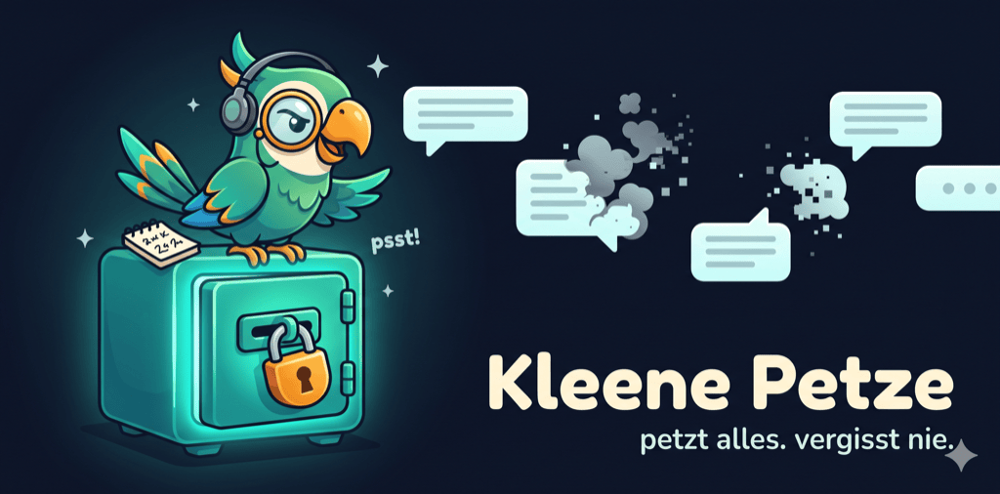

<p align="center">
  
</p>

# Kleene Petze

<!-- Project status -->
<p align="center">
  <a href="https://github.com/pepperonas/kleene-petze/releases/latest"></a>
  <a href="https://github.com/pepperonas/kleene-petze/releases/latest"></a>
  <a href="https://github.com/pepperonas/kleene-petze/releases"></a>
  <a href="https://github.com/pepperonas/kleene-petze/releases/latest"></a>
  <a href="https://github.com/pepperonas/kleene-petze/actions/workflows/release.yml"></a>
</p>
<p align="center">
  <a href="https://github.com/pepperonas/kleene-petze/commits/main"></a>
  <a href="https://github.com/pepperonas/kleene-petze/commits/main"></a>
  <a href="https://github.com/pepperonas/kleene-petze/issues"></a>
  
  
  
</p>

<!-- Tech stack -->
<p align="center">
  
  
  
  
  
  
</p>
<p align="center">
  
  
  
  
  
</p>

<!-- Data & privacy -->
<p align="center">
  
  
  
  
  
  
  
  
</p>

Speichert eingehende Nachrichten-Benachrichtigungen **dauerhaft und verschlüsselt** – wie
der Samsung-Benachrichtigungsverlauf, aber ohne 24-Stunden-Verfall. Gelöschte WhatsApp-
Nachrichten bleiben so lesbar, weil die ursprüngliche Benachrichtigung in eine lokale,
verschlüsselte Datenbank geschrieben wird, sobald sie ankommt.

## Download

Die fertige, signierte APK gibt es unter **[Releases](https://github.com/pepperonas/kleene-petze/releases/latest)**.
APK herunterladen → auf dem Gerät öffnen → Installation aus unbekannter Quelle erlauben.

## Wie es funktioniert

Android liefert jede Benachrichtigung an einen `NotificationListenerService`
(`service/NotificationCaptureService.kt`). WhatsApp sendet beim Löschen einer Nachricht
**keine** zweite Benachrichtigung – die Originalnachricht ist also längst angekommen.
Kleene Petze parst sie sofort (bevorzugt über `MessagingStyle`, das Absender + echten
Zeitstempel jeder Einzelnachricht enthält) und speichert sie ab. Mehrfach gelieferte
Nachrichten werden über einen Inhalts-Hash dedupliziert.

**Korrekte Chat-Zuordnung:** Nachrichten werden über einen *stabilen* Chat-Schlüssel
(`conversationKey` aus `shortcutId` → `tag` → Notification-Slot → Titel) gruppiert, nicht
über den Anzeigenamen. Der ist bei 1:1-Chats oft leer und bei Gruppen manchmal nicht
gesetzt – würde man danach gruppieren, zerfielen Gruppen pro Absender bzw. vermischten
sich mit gleichnamigen Einzelchats. So landet jeder Kontakt/jede Gruppe verlässlich in
genau einem Verlauf. Die Übersicht zeigt pro Chat den **neuesten Titel** + letzte
Nachricht; der Verlauf rendert als Chat-Ansicht mit Datumstrennern, Sprecher-Gruppierung
und farbigen Absendern.

Genau hier lag der Fehler, den **v1.6.2** behebt: WhatsApp liefert bei manchen
Benachrichtigungen keinen Gruppennamen mit. Ohne `shortcutId`/`tag` fiel der Schlüssel
dann auf den **Absender** zurück – die Gruppe zerfiel pro Absender *und* verschmolz mit
den Einzelchats derselben Leute, tauchte also nie als eigener Chat auf. Deshalb wurden
manche Gruppen mitgeschnitten und andere scheinbar nicht. Für Gruppen ist der Absender
jetzt nie mehr Schlüssel oder Titel; ohne eigene ID zählt der **Notification-Slot**, den
der Messenger für diesen Chat wiederverwendet – genauso verlässlich wie das
In-Place-Update, auf dem die ganze Erfassung ohnehin beruht. Der Gruppenname taugt dafür
nicht, weil er in einer Benachrichtigung fehlt und in der nächsten dasteht (der Chat
würde sich teilen). 1:1-Chats bleiben unverändert.

**Rauschfilter (v1.6.2–v1.7.2):** Nicht alles, was ein Messenger postet, ist eine
Nachricht. WhatsApps dauerhafte Dienst-Benachrichtigung („Überprüfe auf neue
Nachrichten"), Backup-/Wiederherstellungs-Fortschritt sowie **Sprach- und Videoanrufe**
(auch verpasste, die WhatsApp separat führt) landen nicht mehr im Archiv – strukturell
über Notification-Flags und -Kategorien (sprachunabhängig) und zusätzlich über eine
Phrasenliste für Geräte, die beides nicht setzen. Geprüft wird **Titel und Text**: ein
verpasster Anruf trägt seinen Wortlaut im *Titel* („Verpasster Sprachanruf") und den
Kontaktnamen im Text – prüfte man nur den Text, rutschte er durch und tauchte, weil der
Titel zum Chatnamen wird, als eigener Chat „Verpasster Sprachanruf" in der Übersicht auf
(genau das behebt v1.6.4). Bereits erfasstes Rauschen wird beim Update einmalig entfernt.

**Medien-Fortschritt (v1.7.2):** Beim Senden von Fotos/Videos zeigt WhatsApp eine laufend
aktualisierte Fortschritts-Benachrichtigung („Sending video to …") – auf einem echten Gerät hatten
sich daraus **2380 Einträge** in einem Müll-Chat angesammelt. Entscheidend ist hier nicht die
Wortliste, sondern dass eine Benachrichtigung mit **Fortschrittsbalken** (`EXTRA_PROGRESS`) nie
eine Nachricht ist – das greift in jeder Sprache. Dasselbe Gerät zeigte außerdem, dass WhatsApp
einen laufenden Anruf „Aktiver Sprachanruf" nennt, was keine bisherige Phrase abdeckte.

## Export & Import (v1.7.0)

Unter *Einstellungen → Export & Import* lässt sich das komplette Archiv in eine Datei schreiben
und genauso wieder einlesen. **Verschlüsselung ist eine Wahl, kein Zwang** – alle drei Formate
sind vollständig und wieder importierbar:

| Format | Datei | wofür |
|---|---|---|
| **Verschlüsselt** | `.kpvault` | AES-256-GCM, Schlüssel per PBKDF2-HmacSHA256 (210 000 Runden). Für alles, was das Gerät verlässt – ohne Passphrase ist die Datei für niemanden lesbar, auch nicht für dich. |
| **JSON** | `.json` | Klartext, vollständig, zusätzlich mit `jq`/Skripten auswertbar. Gültiges JSON, aber **eine Nachricht pro Zeile**, damit der Import zeilenweise streamen kann. |
| **CSV** | `.csv` | Klartext für Tabellenprogramme (semikolongetrennt, RFC 4180). Enthält alle Spalten, auch Zeilenumbrüche innerhalb einer Nachricht. |

Beim **Import genügt ein Knopf**: das Format wird an den ersten Bytes der Datei erkannt, eine
Passphrase wird nur bei der verschlüsselten Variante abgefragt. Vor dem Schreiben zeigt ein
Dialog, was die Datei enthält (Anzahl, Zeitraum, erkanntes Format). Der Import **fügt nur hinzu** –
IDs sind Inhalts-Hashes, vorhandene Nachrichten bleiben unverändert, dieselbe Datei zweimal
einzulesen ändert nichts.

Export und Import laufen **gestreamt**: die Datenbank wird blockweise gelesen und direkt in die
Datei geschrieben, beim Import werden die Datensätze einzeln geparst und in Blöcken übernommen.
Das Archiv muss also nie als Ganzes in den Arbeitsspeicher passen.

## Was geht – und was nicht

| Funktion | Status |
|---|---|
| Text-Nachrichten (1:1 & Gruppen) | ✅ zuverlässig |
| Absender + echter Zeitstempel | ✅ via MessagingStyle |
| Korrekte Chat-Gruppierung (stabiler `conversationKey`, Gruppen auch ohne Gruppennamen) | ✅ |
| Dienst-/Status-Benachrichtigungen, Anrufe und Medien-Fortschritt werden gefiltert (nicht archiviert) | ✅ |
| Chat-Ansicht: Datumstrenner, Sprecher-Gruppierung, Avatare | ✅ |
| Volltextsuche (mit Treffer-Hervorhebung), App-Filter in der Übersicht | ✅ |
| **Export & Import des ganzen Archivs — Verschlüsselung optional** (`.kpvault` verschlüsselt / JSON / CSV, alle drei wieder einlesbar) | ✅ |
| Export pro Chat (CSV/JSON, verlustfrei inkl. Erfassungszeit + Gelöscht-/Bearbeitet-Status) | ✅ |
| Nachricht kopieren/teilen + Details (Long-Press auf die Sprechblase) | ✅ |
| Verschlüsselung (SQLCipher/AES-256), Biometrie-Sperre (re-lockt im Hintergrund) | ✅ |
| Verschlüsselung des Exports (`.kpvault`, Passphrase → PBKDF2 + AES-256-GCM; Import ist merge-sicher) | ✅ |
| Capture-Status (Zugriff/Dienst/letzte Erfassung) + Warn-Banner | ✅ |
| Optionale Aufbewahrungsdauer (30–365 Tage, Standard: unbegrenzt) | ✅ |
| **Gelöschte Nachrichten markieren** (Original hervorgehoben + 🗑-Badge, gesammelt in der „Aufgedeckt"-Ansicht) | ⚠️ nur wenn die Nachricht gelöscht wird, *während sie noch ungelesen im Benachrichtigungs-Shade liegt* (dann ersetzt WhatsApp den Text durch „…gelöscht", den wir der gespeicherten Originalnachricht zuordnen); Platzhalter in 10 Sprachen erkannt |
| **Bearbeitete Nachrichten aufdecken** (frühere Version bleibt sichtbar, ✏️-Markierung) | ⚠️ gleiche Bedingung: die Bearbeitung muss eine Benachrichtigung auslösen, solange der Chat ungelesen ist |
| **Medien** (Fotos, Sprach-/Videonachrichten) | ❌ technisch nicht möglich – stecken nicht in der Notification, Scoped Storage sperrt WhatsApps Medienordner |
| Bereits gelesene Nachrichten, die später gelöscht werden | ❌ erzeugen keine Benachrichtigung → Löschung nicht erkennbar |
| Stummgeschaltete Chats | ❌ erzeugen oft keine Benachrichtigung |
| Nachrichten empfangen, während der Chat offen ist | ❌ keine Benachrichtigung |

## Bauen

1. **Android Studio** (Ladybug/2024.2+) → *Open* → diesen Ordner wählen. Gradle-Sync
   lädt alle Abhängigkeiten (AGP 8.7, Kotlin 2.0, Compose, Room, SQLCipher).
2. Gerät/Emulator anschließen → *Run ▶*.

Oder per Terminal: `./gradlew assembleDebug` → APK unter `app/build/outputs/apk/debug/`.
(Eine `local.properties` mit `sdk.dir=...` wird von Android Studio automatisch angelegt.)

### Tests

Reine JVM-Unit-Tests (kein Emulator nötig):

```bash
./gradlew testDebugUnitTest
```

Aktuell **161 Tests**, alle ohne Android-Framework (die kritische Logik liegt bewusst in
frameworkfreien Modulen). Abgedeckt:

- **Dedup-Schlüssel** – `messageContentId` mit fixem SHA-256-Anker (`MessageId`)
- **Chat-Gruppierung** – Shortcut-ID → Tag → Slot → Titel → App-Label, Sender-/Titel-Auflösung;
  Gruppen ohne eigene ID landen weder beim Absender noch im Einzelchat (`Grouping`)
- **Lösch-Platzhalter** in 10 Sprachen inkl. Beinahe-Treffern, die *nicht* anschlagen dürfen (`Deletion`)
- **Rauschfilter** – Dienst-/Anruf-Benachrichtigungen erkannt, echte Nachrichten nie verworfen (`Noise`)
- **Export/Import-Round-Trip** – Archiv exportiert und wieder eingelesen, alle drei Formate, über
  mehrere Blöcke hinweg, inkl. falscher Passphrase und doppeltem Import (`VaultTransfer`)
- **JSON-Format** – verlustfrei inkl. Umbrüchen/Tabs/Emoji, eine Nachricht pro Zeile (`VaultJson`)
- **CSV-Format** – RFC 4180 mit Umbrüchen in Feldern, fremde Dateien werden abgelehnt (`VaultCsv`)
- **Formaterkennung** – verschlüsselt/JSON/CSV an den ersten Bytes (`VaultFormat`)
- **Export pro Chat** – Escaping inkl. Steuerzeichen, verlustfreie Felder (`ExportUtils`)
- **Dateinamen** – Chat-Titel als Dateiname: keine Pfadtrenner, kein `..`, Längenlimit (`ExportNaming`)
- **Backup-Serialisierung** – Round-Trip inkl. Tabs/Newlines/Unicode, defekte Zeilen (`VaultCodec`)
- **Backup-Verschlüsselung** – Round-Trip, falsche Passphrase, manipulierte Bytes (`VaultBackup`)
- **Restore-Merge** – was importiert wird und welche Flags nachgezogen werden (`BackupMerge`)
- **Aufbewahrung** – wann geprunt wird und ab welchem Stichtag (`RetentionPolicy`)
- **Formatierung** – Datum/Zeit, relative „letzte Erfassung", Farben/Initialen (`Format`)
- **Suche** – LIKE-Escaping und Highlight-Ranges (`SearchUtils`)

## Einrichtung auf dem Samsung S24 Ultra (wichtig)

One UI killt Hintergrunddienste sehr aggressiv. Damit kein Mitschnitt verloren geht:

1. **Benachrichtigungszugriff erteilen** – beim ersten Start, oder
   *Einstellungen → Apps → Spezieller Zugriff → Benachrichtigungszugriff → Kleene Petze*.
2. **Akku-Optimierung ausnehmen** – im Onboarding-Schritt, oder
   *Einstellungen → Akku → Hintergrundnutzungslimits → „Nie in den Standby" → Kleene Petze hinzufügen*.
3. Optional: in *Einstellungen → Apps → Kleene Petze* die Option „Im Hintergrund aktiv lassen".

## Datenschutz / DSGVO

- Keine Netzwerkberechtigung, keine Cloud, kein Tracking. Alles bleibt auf dem Gerät.
- Datenbank verschlüsselt (SQLCipher, 256-bit). Schlüssel in `EncryptedSharedPreferences`
  (AES-256-GCM, Android Keystore). Backups (Cloud/Geräte­transfer) sind deaktiviert.
- Erfasst werden nur Benachrichtigungen, die **auf diesem Gerät** eingehen – also
  Nachrichten *an dich*. Beachte: gespeicherte Inhalte stammen von Dritten; deren
  Weiterverarbeitung/Weitergabe liegt in deiner Verantwortung als Betreiber.

## Projektstruktur

```
data/    CapturedMessage (Entity, mit conversationKey + editSuperseded), MessageDao,
         AppDatabase (v4), DatabaseProvider (SQLCipher + Migrationen),
         SettingsStore (DataStore), RetentionPruner + RetentionPolicy (Aufbewahrung),
         BackupMerge (Restore-Plan: importiert vs. Flags nachziehen),
         NoiseCleanup (einmaliges Entfernen früher erfasster Dienst-/Anruf-Einträge)
notif/   MessageExtractor – Notification → CapturedMessage(s)
         MessageId – stabiler Dedup-Inhalts-Hash (messageContentId)
         Grouping – Chat-Schlüssel/Titel/Sender-Auflösung (frameworkfrei)
         Deletion – Lösch-Platzhalter-Erkennung (10 Sprachen)
         Noise – Dienst-/Status- und Anruf-Benachrichtigungen aussortieren
service/ NotificationCaptureService – der Listener (Edit-Erkennung, Heartbeat, Status)
ui/      Compose-Screens (Onboarding, Home, Conversation, Flagged/„Aufgedeckt", Settings)
         + ViewModel, Components (Avatar), Format (Datum/Zeit, Farben, Initialen)
util/    PermissionUtils, ExportNaming, SearchUtils, ShareExport (Teilen pro Chat)
         VaultFormat  – Formaterkennung (verschlüsselt / JSON / CSV)
         VaultJson    – Klartextformat, eine Nachricht pro Zeile (streambar)
         VaultCsv     – verlustfreies RFC-4180-CSV inkl. Umbrüchen in Feldern
         VaultTransfer– gestreamter Export/Import + Vorschau, Merge in Blöcken
         VaultCodec + VaultBackup (verschlüsselter Container .kpvault)
         ExportUtils  – dieselben Formate im Speicher, für den Export pro Chat
schemas/ Room-Schema-JSON (Referenz für handgeschriebene Migrationen)
src/test JUnit-Unit-Tests (MessageId, Grouping, Deletion, Noise, ExportUtils, ExportNaming,
         VaultJson, VaultCsv, VaultFormat, VaultTransfer, VaultCodec, VaultBackup,
         BackupMerge, RetentionPolicy, Format, SearchUtils)
```

## Release erstellen (Maintainer)

Releases werden signiert und automatisch von GitHub Actions gebaut
(`.github/workflows/release.yml`). Der Signing-Keystore liegt **nur** im privaten Repo
`pepperonas/keystore` und in den Repo-Secrets (`KEYSTORE_BASE64`, `KEYSTORE_PASSWORD`,
`KEY_ALIAS`, `KEY_PASSWORD`) – nie in diesem Repo.

```bash
# versionCode (+1) und versionName in app/build.gradle.kts erhöhen, dann:
git tag v1.2.3 && git push origin v1.2.3
```

Der Workflow baut die signierte APK und hängt sie an einen neuen GitHub Release. Alle
Releases sind mit demselben Keystore signiert und damit als Update übereinander
installierbar.

---
© 2026 Martin Pfeffer | celox.io
