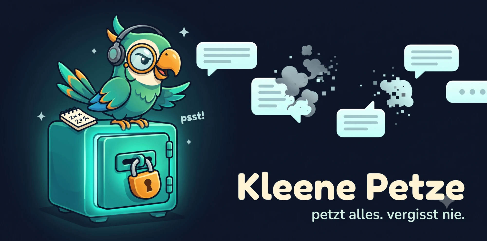
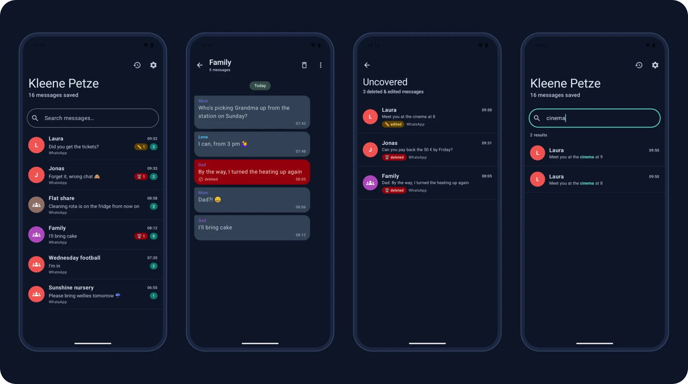
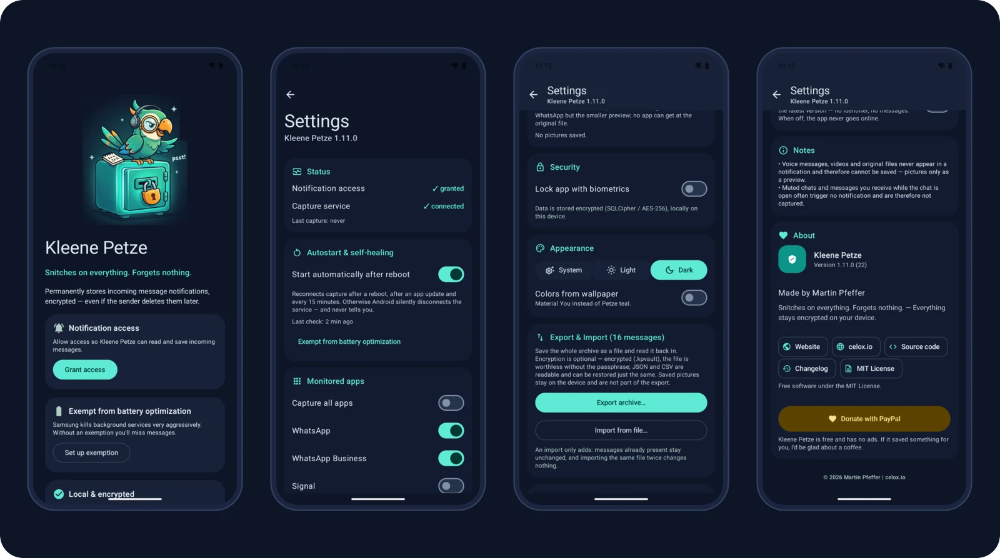

<div align="center">

<a href="https://kleene-petze.celox.io"></a>

# 🦜 Kleene Petze

**Petzt alles. Vergisst nie.** — snitches on everything, forgets nothing: an encrypted, permanent archive of your message notifications for Android. Deleted WhatsApp messages stay readable.

<p>
  <a href="https://kleene-petze.celox.io"></a>
  &nbsp;
  <a href="https://kleene-petze.celox.io/download"></a>
  &nbsp;
  <a href="https://www.paypal.com/donate/?business=martin.pfeffer@celox.io&currency_code=EUR&item_name=Kleene%20Petze"></a>
</p>

<h3>👉 <a href="https://kleene-petze.celox.io">kleene-petze.celox.io</a> — features, install guide, FAQ and always the newest APK</h3>

<!-- Generated by scripts/update-badges.py — never edit these four by hand (ReadmeBadgesTest). -->
[](https://github.com/pepperonas/kleene-petze/releases/latest)
[](app/src/test)
[](app/src/main/java)
[](app/src/test)

</div>

<!-- Project status -->
<p align="center">
  <a href="https://github.com/pepperonas/kleene-petze/releases/latest"></a>
  <a href="https://github.com/pepperonas/kleene-petze/releases/latest"></a>
  <a href="https://github.com/pepperonas/kleene-petze/releases"></a>
  <a href="https://github.com/pepperonas/kleene-petze/releases/latest"></a>
  <a href="https://github.com/pepperonas/kleene-petze/actions/workflows/release.yml"></a>
</p>
<p align="center">
  <a href="https://github.com/pepperonas/kleene-petze/commits/main"></a>
  <a href="https://github.com/pepperonas/kleene-petze/commits/main"></a>
  <a href="https://github.com/pepperonas/kleene-petze/issues"></a>
  
  
  
</p>

<!-- Tech stack -->
<p align="center">
  
  
  
  
  
  
</p>
<p align="center">
  
  
  
  
  
</p>

<!-- Data & privacy -->
<p align="center">
  
  
  
  
  
  
  <a href="LICENSE"></a>
  
</p>

<!-- Promises -->
<p align="center">
  
  
  
  
  
  <a href="https://kleene-petze.celox.io"></a>
  <a href="CHANGELOG.md"></a>
  <a href="https://github.com/pepperonas/kleene-petze/stargazers"></a>
  <a href="https://www.paypal.com/donate/?business=martin.pfeffer@celox.io&currency_code=EUR&item_name=Kleene%20Petze"></a>
</p>

**English** · [Deutsch](README.de.md)

Stores incoming messaging notifications **permanently and encrypted** – like Samsung's
notification history, but without the 24-hour expiry. Deleted WhatsApp messages stay
readable, because the original notification is written to a local, encrypted database
the moment it arrives.

## Screenshots

<p align="center">
  
</p>
<p align="center">
  
</p>

<sub>Material 3 Expressive in the dark theme. The chats are invented for the screenshots — never real messages.</sub>

## Download

The finished, signed APK is available at **[kleene-petze.celox.io](https://kleene-petze.celox.io)**
and under **[Releases](https://github.com/pepperonas/kleene-petze/releases/latest)**.
Download the APK → open it on the device → allow installation from unknown sources.

If you like, the app announces new versions itself: *Settings → Updates → Check for updates*
(off by default, see [Privacy](#privacy--gdpr)). What changed is listed in the
[CHANGELOG](CHANGELOG.md).

## New in 1.11.0

- **English and German** – the app now ships in both languages. The phone's language picks
  one; for any other language the app shows English.
- On **Android 13+** the app language can be set independently of the phone:
  *Settings → Apps → Kleene Petze → Language*.
- A unit test (`LocalizationTest`) keeps both languages in step – same keys and the same
  format placeholders.

## New in 1.10.0

- **Material 3 Expressive** – `MaterialExpressiveTheme` with a spring-based `MotionScheme`: large
  flexible top bars, settings as cards that spring in staggered, screen transitions, springy
  press feedback, `LoadingIndicator`, a connected button group for light/dark/system.
  "Remove animations" is respected.
- **About the app** – version, website, source code, changes, license and a PayPal donate button.
- **Optional update check** – off until you turn it on.
- **Lock fixed** – with the app lock active, export and import got lost; now the UI underneath
  the lock is preserved, and the app switcher shows no content (`FLAG_SECURE`).
- Details and all other fixes: [CHANGELOG](CHANGELOG.md).

## How it works

Android delivers every notification to a `NotificationListenerService`
(`service/NotificationCaptureService.kt`). When a message is deleted, WhatsApp sends
**no** second notification – so the original message has long since arrived.
Kleene Petze parses it immediately (preferably via `MessagingStyle`, which carries the sender +
real timestamp of every individual message) and stores it. Messages delivered multiple
times are de-duplicated via a content hash.

**Correct chat assignment:** messages are grouped by a *stable* chat key
(`conversationKey` from `shortcutId` → `tag` → notification slot → title), not by the
display name. That name is often empty for 1:1 chats and sometimes unset for groups –
grouping by it would split groups per sender or mix them with identically named
individual chats. This way every contact/group reliably ends up in exactly one
history. The overview shows the **newest title** + last message per chat; the history
renders as a chat view with date separators, sender grouping and colored senders.

This is exactly where the bug fixed by **v1.6.2** lay: WhatsApp omits the group name from
some notifications. Without `shortcutId`/`tag` the key then fell back to the **sender** –
the group split per sender *and* merged with the individual chats of the same people, so it
never showed up as a chat of its own. That's why some groups were captured and others
seemingly weren't. For groups the sender is now never the key or the title; without an ID of
its own, the **notification slot** counts, which the messenger reuses for that chat – just
as reliable as the in-place update the entire capture relies on anyway. The group name is
no good for this, because it is missing in one notification and present in the next (the
chat would split). 1:1 chats are unchanged.

**Noise filter (v1.6.2–v1.7.2):** not everything a messenger posts is a message.
WhatsApp's permanent service notification ("Checking for new messages"), backup/restore
progress and **voice and video calls** (including missed ones, which WhatsApp keeps
separately) no longer end up in the archive – structurally via notification flags and
categories (language-independent), and additionally via a phrase list for devices that set
neither. Both **title and text** are checked: a missed call carries its wording in the
*title* ("Missed voice call") and the contact name in the text – checking only the text let
it slip through and, since the title becomes the chat name, it appeared as a chat of its own
called "Missed voice call" in the overview (exactly what v1.6.4 fixes). Noise that was
already captured is removed once on update.

**Media progress (v1.7.2):** when sending photos/videos, WhatsApp shows a continuously
updated progress notification ("Sending video to …") – on a real device this had piled up
**2380 entries** in a junk chat. What matters here is not the word list but the fact that a
notification with a **progress bar** (`EXTRA_PROGRESS`) is never a message – that works in
every language. The same device also showed that WhatsApp calls an ongoing call
"Aktiver Sprachanruf" (active voice call), which no previous phrase covered.

## Pictures with captions (v1.9.0)

**The caption under a picture was never the problem** – it *is* the message text and was
always saved. Two other things got lost:

* **Pictures without a caption** vanished entirely. A message needs text to have an identity
  at all (the ID is a hash over the content), and the extractor discarded every
  MessagingStyle message with empty text. It now gets a placeholder and is kept.
* **The picture itself** was never stored.

What is saved now is the **preview the notification brings along** – not the original file.
The difference matters and is not a matter of convenience: since Scoped Storage, no other app
can reach WhatsApp's media folder. The preview, however, lives in the notification, and a
notification listener may read it – according to the Android docs it is granted read access
to **every** URI of a notification, but **only while it is active**. That's why the picture is
decoded immediately on arrival and no URI is ever kept for later.

| Source | when |
|---|---|
| `MessagingStyle.Message.getDataUri()` | the usual way – the picture is attached to the individual message |
| `BigPictureStyle` (`EXTRA_PICTURE`) | older layouts, the picture is attached to the notification |

It is stored as JPEG (max. 1280 px, max. 512 KB) **as a BLOB in the encrypted database**,
not as a file – otherwise the picture, of all things, would be the unencrypted part of the
archive. In a table of its own, so the overview and chat queries don't drag image data along
on every call. Can be turned off under *Settings → Pictures*, together with the storage used
and a button that removes just the pictures.

**Voice messages and videos are left out** – there is no preview for them in the
notification. And **pictures are not part of the export**: they stay on the device.

## Autostart & self-healing (v1.8.0)

The worst conceivable failure of this app is not a crash but **silently doing nothing**: the
capture service is not started by the app but *bound* by the system – and Android drops
that binding in three situations without reporting it anywhere:

* **after an app update** – the system unhooks the old code and sometimes fails to bind the
  new one (a known platform bug),
* **when the manufacturer kills the process** – Samsung's "deep sleep" doesn't disconnect
  politely, so `onListenerDisconnected()` never runs, and neither does the self-repair call
  that used to live in it,
* **after a reboot**, when the binding isn't restored.

In all three cases nothing is running in the service any more that could report it. The
repair therefore has to come **from outside**:

| Mechanism | kicks in |
|---|---|
| `BootReceiver` (`BOOT_COMPLETED`, `QUICKBOOT_POWERON`) | after every reboot |
| the same receiver on `MY_PACKAGE_REPLACED` | after every app update – the most likely reason capture "suddenly" stopped |
| `WatchdogJobService`, every 15 min, `setPersisted` | any other time; even survives a reboot without a broadcast |
| "Reconnect" button in the banner + in the settings | immediately, when you notice it yourself |

All of it lives under *Settings → Autostart & self-healing* and is **on by default**.
It also shows when the last check ran. If it hasn't run for more than 45 minutes, that is
the one symptom **no** reconnect can cure: then battery saving is freezing the entire
app – the setting shows the button to exempt it right there.

The banner on the home screen now also tells the truth. It used to say "usually reconnects
by itself" – exactly the assumption that caused the outage.

## Export & import (v1.7.0)

Under *Settings → Export & import* the complete archive can be written to a file and read
back in just the same way. **Encryption is a choice, not a requirement** – all three formats
are complete and re-importable:

| Format | File | for |
|---|---|---|
| **Encrypted** | `.kpvault` | AES-256-GCM, key via PBKDF2-HmacSHA256 (210,000 rounds). For anything that leaves the device – without the passphrase the file is readable by no one, not even you. |
| **JSON** | `.json` | Plain text, complete, and also analyzable with `jq`/scripts. Valid JSON, but **one message per line**, so the import can stream line by line. |
| **CSV** | `.csv` | Plain text for spreadsheet programs (semicolon-separated, RFC 4180). Contains all columns, including line breaks within a message. |

For **import, one button is enough**: the format is recognized from the first bytes of the
file, and a passphrase is only asked for with the encrypted variant. Before writing, a
dialog shows what the file contains (count, time range, detected format). The import
**only adds** – IDs are content hashes, existing messages stay unchanged, and reading the
same file twice changes nothing.

Export and import are **streamed**: the database is read in blocks and written straight
into the file; on import the records are parsed one by one and taken over in blocks.
So the archive never has to fit into memory as a whole.

## What works – and what doesn't

| Feature | Status |
|---|---|
| Text messages (1:1 & groups) | ✅ reliable |
| Sender + real timestamp | ✅ via MessagingStyle |
| Correct chat grouping (stable `conversationKey`, groups even without a group name) | ✅ |
| Service/status notifications, calls and media progress are filtered (not archived) | ✅ |
| Chat view: date separators, sender grouping, avatars | ✅ |
| Full-text search (with match highlighting), app filter in the overview | ✅ |
| **Export & import of the whole archive — encryption optional** (`.kpvault` encrypted / JSON / CSV, all three re-importable) | ✅ |
| Export per chat (CSV/JSON, lossless incl. capture time + deleted/edited status) | ✅ |
| Copy/share a message + details (long-press on the bubble) | ✅ |
| Encryption (SQLCipher/AES-256), biometric lock (re-locks in the background) | ✅ |
| Encryption of the export (`.kpvault`, passphrase → PBKDF2 + AES-256-GCM; import is merge-safe) | ✅ |
| Capture status (access/service/last capture) + warning banner | ✅ |
| **Autostart after reboot & app update + 15-min watchdog**, can be turned off in the settings | ✅ |
| Optional retention period (30–365 days, default: unlimited) | ✅ |
| **Flag deleted messages** (original highlighted + 🗑 badge, collected in the "Uncovered" view) | ⚠️ only if the message is deleted *while it is still unread in the notification shade* (WhatsApp then replaces the text with "…deleted", which we match to the stored original message); placeholders recognized in 10 languages |
| **Uncover edited messages** (earlier version stays visible, ✏️ marker) | ⚠️ same condition: the edit has to trigger a notification while the chat is unread |
| **Pictures with captions** – caption always, picture preview optional | ✅ the caption is the message text; the picture is saved as a **preview from the notification** (JPEG, encrypted in the DB) |
| **Original media files** (full resolution, voice/video messages) | ❌ technically impossible – the original file isn't in the notification, and Scoped Storage locks WhatsApp's media folder |
| Messages already read that are deleted later | ❌ produce no notification → deletion not detectable |
| Muted chats | ❌ often produce no notification |
| Messages received while the chat is open | ❌ no notification |

## Building

1. **Android Studio** (Ladybug/2024.2+) → *Open* → choose this folder. Gradle sync
   downloads all dependencies (AGP 8.7, Kotlin 2.0, Compose, Room, SQLCipher).
2. Connect a device/emulator → *Run ▶*.

Or from the terminal: `./gradlew assembleDebug` → APK under `app/build/outputs/apk/debug/`.
(A `local.properties` with `sdk.dir=...` is created automatically by Android Studio.)

### Tests

Pure JVM unit tests (no emulator needed):

```bash
./gradlew testDebugUnitTest
```

The current count is on the **unit tests** badge at the top — generated, never typed (see below).
All of them run without the Android framework (the critical logic deliberately lives in
framework-free modules). Covered:

- **Dedup key** – `messageContentId` with a fixed SHA-256 anchor (`MessageId`)
- **Chat grouping** – shortcut ID → tag → slot → title → app label, sender/title resolution;
  groups without an ID of their own end up neither with the sender nor in the individual chat (`Grouping`)
- **Deletion placeholders** in 10 languages, including near-misses that must *not* match (`Deletion`)
- **Noise filter** – service/call notifications recognized, real messages never discarded (`Noise`)
- **Watchdog rules** – when to rebind, when the watchdog runs, and from when on its absence
  is a symptom (including a clock set back) (`WatchdogPolicy`)
- **Image rules** – scaling/subsampling without quality loss, icon floor, MIME gate (`ImagePolicy`)
- **Migration DDL** – the hand-written v4→v5 migration against Room's exported schema (`AttachmentSchema`)
- **Export/import round trip** – archive exported and read back in, all three formats, across
  multiple blocks, including a wrong passphrase and a double import (`VaultTransfer`)
- **JSON format** – lossless incl. line breaks/tabs/emoji, one message per line (`VaultJson`)
- **CSV format** – RFC 4180 with line breaks in fields, foreign files are rejected (`VaultCsv`)
- **Format detection** – encrypted/JSON/CSV from the first bytes (`VaultFormat`)
- **Export per chat** – escaping incl. control characters, lossless fields (`ExportUtils`)
- **File names** – chat title as a file name: no path separators, no `..`, length limit (`ExportNaming`)
- **Backup serialization** – round trip incl. tabs/newlines/Unicode, broken lines (`VaultCodec`)
- **Backup encryption** – round trip, wrong passphrase, tampered bytes (`VaultBackup`)
- **Restore merge** – what gets imported and which flags are re-applied (`BackupMerge`)
- **Retention** – when pruning happens and from which cut-off date (`RetentionPolicy`)
- **Formatting** – date/time, relative "last capture", colors/initials, including the English
  date and relative-time words (`Format`)
- **Translations** – English and German have the same keys and the same placeholders
  (`LocalizationTest`)
- **Search** – LIKE escaping and highlight ranges (`SearchUtils`)
- **App lock** – only a permanently missing lock skips the prompt (`LockPolicy`)
- **Update check** – version comparison, report once per version, no job without opt-in,
  product page before GitHub (`AppVersion`, `UpdatePolicy`, `ReleaseSource`)
- **About/donation links** – PayPal link, product page, license (`AboutLinks`)
- **Motion** – rise/staggering of the transitions (`ScreenMotion`)
- **Changelog** – every version has a dated section (`ChangelogTest`)
- **Export under load** – messages arriving/deleted during the export, an aborted export
  never yields a valid encrypted file (`VaultTransfer`)
- **Permissions & privacy** – the manifest requests exactly the expected permissions, backups
  stay off, WorkManager's auto-initializer stays removed (`ManifestTest`)
- **No hard-coded German** – English default carries no German, UI code has no German literals
  (`LocalizationTest`)
- **Theme choice** – stored names round-trip, anything unknown follows the system (`ThemeModeTest`)
- **Plaintext cleanup** – shared chat exports are deleted, in exactly the folder the FileProvider
  serves (`ShareExportCleanupTest`)
- **README badges** – version, test count and lines of code match the code; both READMEs carry the
  same badges and the app's PayPal link; every image exists (`ReadmeBadgesTest`)

The four big badges and `.github/repo-stats.json` (shown on the product page) come from
`python3 scripts/update-badges.py` — run it after adding code or tests; `--check` only reports.

## Setup on the Samsung S24 Ultra (important)

One UI kills background services very aggressively. So that no capture gets lost:

1. **Grant notification access** – on first start, or
   *Settings → Apps → Special access → Notification access → Kleene Petze*.
2. **Exempt from battery optimization** – in the onboarding step, or
   *Settings → Battery → Background usage limits → "Never sleeping apps" → add Kleene Petze*.
3. Optional: in *Settings → Apps → Kleene Petze* the option "Allow background activity".

## Privacy / GDPR

- No cloud, no tracking. Captured messages never leave the device — there is no code path
  that sends them anywhere.
- Since 1.10.0 the `INTERNET` permission is used by exactly one feature: the **optional
  update check**, **off** by default. When turned on, the app asks
  `kleene-petze.celox.io/latest.json` (fallback: GitHub API) once a day for the newest version
  number — without an identifier, without device data. When turned off, no background job is
  created and the app makes not a single network request (guaranteed by a test: `UpdatePolicyTest`).
- Database encrypted (SQLCipher, 256-bit). Key in `EncryptedSharedPreferences`
  (AES-256-GCM, Android Keystore). Backups (cloud/device transfer) are disabled.
- Only notifications that arrive **on this device** are captured – i.e. messages *to you*.
  Note: stored content comes from third parties; processing/passing it on is your
  responsibility as the operator.

## Project structure

```
data/    CapturedMessage (entity, with conversationKey + editSuperseded), MessageDao,
         AppDatabase (v5, messages + attachments), DatabaseProvider (SQLCipher + migrations),
         SettingsStore (DataStore), RetentionPruner + RetentionPolicy (retention),
         BackupMerge (restore plan: imported vs. re-apply flags),
         NoiseCleanup (one-time removal of previously captured service/call entries)
notif/   MessageExtractor – notification → CapturedMessage(s)
         MessageId – stable dedup content hash (messageContentId)
         Grouping – chat key/title/sender resolution (framework-free)
         Deletion – deletion placeholder detection (10 languages)
         Noise – sort out service/status and call notifications
service/ NotificationCaptureService – the listener (edit detection, heartbeat, status)
         ListenerWatchdog + WatchdogJobService – rebinding, 15-min job (persisted)
         BootReceiver – rebinding after reboot and after app update
         WatchdogPolicy – the decisions for it, framework-free and tested
ui/      Compose screens (Onboarding, Home, Conversation, Flagged/"Uncovered", Settings)
         + ViewModel (incl. export/import state, lock session), Components (Avatar),
         Format (date/time, colors, initials)
ui/about AboutLinks (website, source code, license, PayPal), About/Update/Appearance cards
ui/theme MaterialExpressiveTheme, colors, Motion (MotionScheme tokens, springPressed,
         springEntrance, ScreenTransitions)
update/  Opt-in update check: AppVersion, UpdatePolicy (framework-free), ReleaseSource,
         UpdateCheckStore, UpdateChecker (notification), UpdateScheduler (WorkManager)
util/    PermissionUtils, ExportNaming, SearchUtils, ShareExport (sharing per chat)
         VaultFormat  – format detection (encrypted / JSON / CSV)
         VaultJson    – plain-text format, one message per line (streamable)
         VaultCsv     – lossless RFC 4180 CSV incl. line breaks in fields
         VaultTransfer– streamed export/import + preview, merge in blocks
         VaultCodec + VaultBackup (encrypted container .kpvault)
         ExportUtils  – the same formats in memory, for the per-chat export
schemas/ Room schema JSON (reference for hand-written migrations, guarded by a test)
res/     values/ English (default), values-de/ German; xml/locales_config.xml (per-app language)
docs/    banner + screenshots (mockups in English and German)
scripts/ update-badges.py (README badges + repo stats), release-notes.sh (CHANGELOG → release)
src/test JUnit unit tests — one class per seam above, plus Manifest, Localization,
         ReadmeBadges, Changelog and ShareExportCleanup
```

## Creating a release (maintainers)

Releases are signed and built automatically by GitHub Actions
(`.github/workflows/release.yml`). The signing keystore lives **only** in the private repo
`pepperonas/keystore` and in the repo secrets (`KEYSTORE_BASE64`, `KEYSTORE_PASSWORD`,
`KEY_ALIAS`, `KEY_PASSWORD`) – never in this repo.

```bash
# bump versionCode (+1) and versionName in app/build.gradle.kts,
# write a section "## [1.2.3] - YYYY-MM-DD" in CHANGELOG.md (ChangelogTest checks this), then:
git tag v1.2.3 && git push origin v1.2.3
```

The workflow runs the tests, builds the signed APK and attaches it together with
`SHA256SUMS.txt` to a new GitHub Release; the release notes come from the CHANGELOG
(`scripts/release-notes.sh`). The product page mirrors the release within 15 minutes. All
releases are signed with the same keystore and can therefore be installed over each other
as updates.

## License & support

[MIT](LICENSE) © 2026 Martin Pfeffer. Kleene Petze is free and ad-free — if it has rescued
something for you: [Donate via PayPal](https://www.paypal.com/donate/?business=martin.pfeffer@celox.io&currency_code=EUR&item_name=Kleene%20Petze).

---
© 2026 Martin Pfeffer | [celox.io](https://celox.io) · [kleene-petze.celox.io](https://kleene-petze.celox.io)
